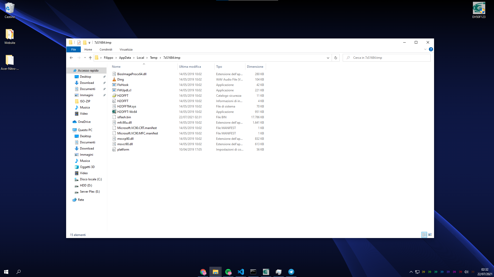
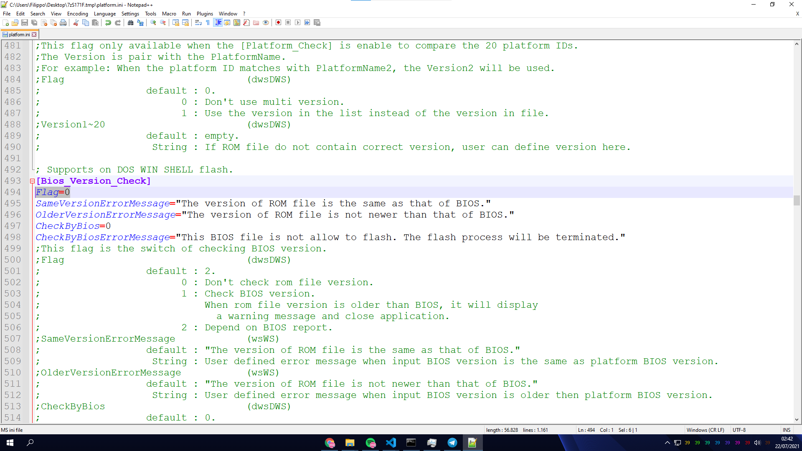
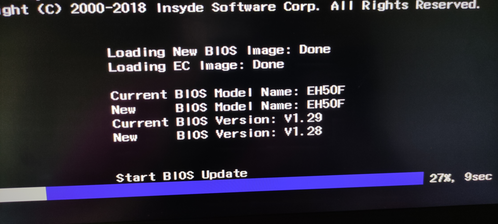
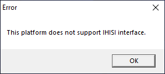

# MacOS on the Acer Nitro 7 AN715-51
Similar models like Nitro 5 should work as well, al long as they are 9th gen Intel CPUs. Some changes may be required depending on small changes between models, for example the network card.
# Important BIOS note
If you are on the first version of the BIOS (I think mine shipped with 1.0), **do not upgrade**, since power management is a mess. In case you have already updated, read below for how to downgrade. 
## Downgrading the  BIOS
The BIOS version with the best power management would be 1.0, but if you have upgraded, a downgrade is possible, even if the oldest version available for download on Acer's website is 1.05.
However, apart from 1.0, the BIOS with the best power management still available for download is 1.23, which you can download from [here](https://global-download.acer.com/GDFiles/BIOS/BIOS/BIOS_Acer_1.23_A_A.zip?acerid=637091329613704278&Step1=NOTEBOOK&Step2=NITRO&Step3=NITRO%20AN715-51&OS=ALL&LC=it&BC=ACER&SC=EMEA_17). Please note that the above linked BIOS is for use **only** on the AN715-51. In order to downgrade, download the BIOS, plug in your laptop charger, and open the executable file. It will give an error about the version not being newer than the one already installed, **do not close the error window**, and go into "C:\Users\username\AppData\Local\Temp\7zSomething.tmp". Other programs might create temp fodlers starting with 7z.., so select the one with the following contents:

Copy the entire folder to your desktop. At this point, you can close the error, the bios updater app will close automatically
Open the platform.ini file in any text editor (I'm using Notepad++), and search for "flag=2", replacing the 2 with 0.

Correctly modified platform.ini
Once this is done, launch H2OFFT-Wx64.exe within the folder you copied on your desktop, and proceed with the "upgrade".

When the laptop restarts, you will hear the fans running at max speed, don't worry, it's normal during a BIOS update or downgrade on this laptop, and this is what the process will look like. Do not touch anything, nor unplug the charger from your laptop, as you risk damaging it, and even if there is a way to recover it, you wanna avoid that.
Don't consider the versions displayed in this picture, since it was the only one I took while testing, as I didn't feel like messing again with my BIOS just to take the picture on the correct version.
Once this is done, the laptop should restart a few times, and **should** boot back into Windows.
If it doesn't, read the next paragraph for how to restore the bios.
## Restoring a corrupted BIOS
Whenever you touch your BIOS, there is a chance of something going wrong, and bricking your laptop, so, just in case that happens, here is how to fix it.
### Requirements
- A USB drive which contents can be erased, not too large (perosnally tested up to 32GB)
- A working Windows computer
- The **1.05** bios version for the laptop, which you can get from [here](https://global-download.acer.com/GDFiles/BIOS/BIOS/BIOS_Acer_1.05_A_A.zip?acerid=636965096230164725&Step1=NOTEBOOK&Step2=NITRO&Step3=NITRO%20AN715-51&OS=ALL&LC=it&BC=ACER&SC=EMEA_17)

### Preparing the USB drive
- Format the usb drive using the FAT32 filesystem.

Extract the bios file you downloaded from the requirements section, and run the executable. Since you are on a different system, you will probably get an error like this:

**Don't close it**, and go in the "C:\Users\username\AppData\Local\Temp\7zSomething.tmp" folder, and copy the **isflash.bin** file to the usb drive.
### On the laptop
First of all make sure the laptop is completely off. Plug in your usb drive, in the usb port dedicated for charging devices, which should be on the left side, and have a battery icon near it. Now plug in your laptop charger (**you must do this, otherwise it won't work**), and while holding down the fn + esc keys press the power button, and as soon as you hear the fans running at full speed, release fn and escape. 
Again, do not touch anything and do not unplug the charger, the laptop should restart automatically in a few minutes. It may have a few "strange" and very quick reboots, but should ultimately boot back up.
If the laptop doesn't 